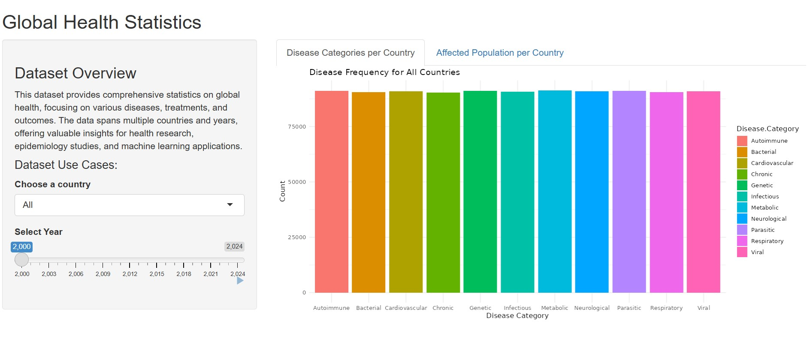
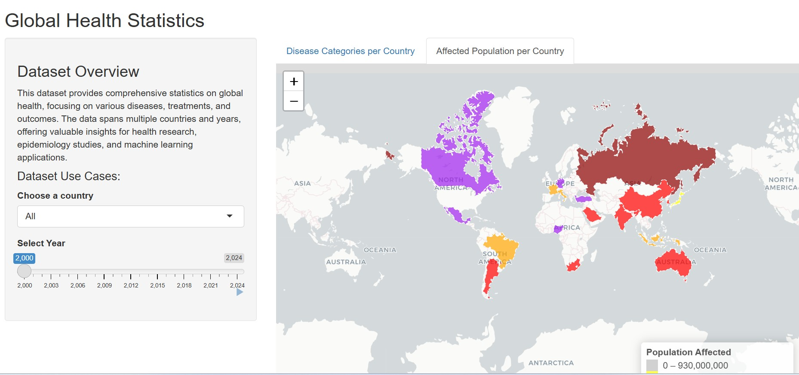

```{r setup, include=FALSE}
knitr::opts_chunk$set(echo = TRUE)
```

# Dashboards with Shiny

Dashboards are an excellent way to share analysis results. Throughout this project, I learned key concepts related to Geocomputation and Shiny dashboards. I was able to apply these skills in a project focused on Global Health Statistics, where I built an interactive Shiny application to visualize global health data and deployed it on Shiny.

*[Global Health Statistics]* (https://lynnstacykegeshi.shinyapps.io/globalhealth/) link.


The first step is to install the Shiny R package

## Structure of a Shiny App
Understanding the file structure of a Shiny app is crucial. Create a new directory before starting, which can be made easier by choosing "New Project" in RStudio and selecting "Shiny Web Application." This will create the basic structure of a Shiny app. The essential file structures are either
- `app.R` or 
- `ui.R` and `server.R`. 

The `ui` and `server` objects must be defined in every Shiny app and are central to the app's structure. The `ui` element creates an HTML interface, including widgets, plots, tables, navigation aspects, and generic text. 

The `server` element runs code in response to user interactions, updating the `ui` accordingly.

## Building a UI
When building an app, it is easier to work on the `ui` first to visualize what you are creating. Use a template for the `ui`, starting with a basic layout from the base Shiny package. 
A Shiny `ui` is generally defined as a series of nested functions, starting with a general layout function like `fluidPage()`. Within the layout, use panels such as `sidebarPanel()`, `mainPanel()`, `tabPanel()`, and `column()`. 
Widgets and outputs are added within these panels, with widgets styled as `xxxInput()` (e.g., `selectInput()`) and outputs as `xxxOutput()` (e.g., `plotOutput()`).

## Loading Data into the App
Before developing the server, load the necessary packages and data, and transform the data into a tidy format. 

Create a function to visualize the data based on user inputs. Determine which parts of the process need to run only once and which parts need to respond to user inputs. For example, load the data and perform basic transformations outside the server, while the visualization code runs in response to user inputs. 

## Developing an App Server
The server function reacts to user inputs and updates outputs accordingly. The server is a large R function composed of smaller tasks or functions that activate when user inputs change. 
The three basic types of Shiny objects are:
- reactive sources (user inputs)
- reactive conductors (objects used within the server)
- endpoints (outputs passed to the `ui`).

For example, use `renderPlot()` to create plots and `downloadHandler()` for downloads. Optimize performance by using reactive conductors like `reactive()` and `eventReactive()` to avoid redundant code execution.


## Adding More Functionality
Enhance the app by adding static text, a download button, and a facility selector. Use HTML tags like `h1()`, `p()`, `tags$b()`, and `tags$i()` to add static text. 
Add a download button with `downloadButton()` and `downloadHandler()`. Implement a facility selector and dynamically update `ui` elements using `observe()` and `updateSelectInput()`. For example, filter the list of facilities based on the selected district and update the facility selector accordingly.

## Adding Another Tab with a Table
Create a tabbed layout in the `ui` using `tabsetPanel()`, with one tab for epidemic curves and another for data. U

Use the `DT` package to render interactive tables. For example, add a tab for displaying the raw data using `DT::dataTableOutput()` and render the data in the server using `DT::renderDT()`.

## Sharing Shiny Apps
Share the app by either sharing the code directly or publishing it on a server like shinyapps.io or RStudio Connect. Ensure the app runs without extra code and avoid explicit file paths. If publishing on shinyapps.io, create an account, generate a token, and deploy the app. 

# Geocomputation with R

Geocomputation involves using computational techniques to analyze and visualize geographic data. Communicating the results effectively is a crucial aspect of geographic research, and map-making (cartography) is an essential skill in this process. While static mapping in R can be straightforward using the `plot()` function, this chapter focuses on advanced cartography using dedicated map-making packages, particularly `tmap`.

## Packages and Data
The chapter uses several packages:
- `sf`, `terra`, `dplyr`, `spData`, `spDataLarge` for spatial data manipulation.
- `tmap` for creating static and interactive maps.
- `leaflet` for interactive maps.
- `ggplot2` for data visualization.

## Static Maps
Static maps are the most common type of visual output in geocomputation. They are usually stored in standard formats like .png and .pdf. The `tmap` package is highlighted for its powerful and flexible map-making capabilities, allowing the creation of attractive maps with minimal code. `tmap` supports both static and interactive maps using the same code via `tmap_mode()`.

### tmap Basics
`tmap` is based on the 'grammar of graphics' concept, similar to `ggplot2`. 
The basic building block is `tm_shape()`, which defines the input data (vector or raster), followed by layer elements like `tm_fill()` and `tm_borders()`. 
Layers are added using the `+` operator. 
The `qtm()` function provides quick thematic maps with good default visualizations.

**Map Objects:**
`tmap` allows storing map objects, which can be plotted later or built upon by adding new layers. For example, `tm_shape(nz) + tm_polygons()` creates a map object that can be modified by adding more shapes and layers.

**Visual Variables:**
Map aesthetics can be customized using visual variables like `fill`, `col`, `lwd`, `lty`, `size`, and `shape`. These variables can be mapped to data attributes or set to fixed values. The `tm_fill()` function, for example, can use a column name to determine fill colors based on data values.

**Scales:**
Scales control how values are represented on the map and in the legend. The `tm_scale_*()` functions customize scales for different visual variables. For example, `tm_scale_intervals()` splits data into intervals, and `tm_scale_continuous()` presents continuous color fields. Color palettes can be customized using the `values` argument.

**Legends:**
Legends provide context for map elements. The `tm_legend()` function customizes legend titles, positions, orientations, and other settings. Legends should clearly convey what they represent and the units of the variable.

**Layouts:**
Map layouts combine all elements into a cohesive map. Additional elements like graticules, north arrows, scale bars, and titles can be added using functions like `tm_graticules()`, `tm_compass()`, `tm_scalebar()`, and `tm_title()`. Layout settings can be customized using `tm_layout()`.

**Faceted Maps:**
Faceted maps, or 'small multiples,' visualize how spatial relationships change with another variable, such as time. The `tm_facets_wrap()` function creates faceted maps, allowing the visualization of data across different dimensions.

## Inset Maps
Inset maps provide context or focus on specific areas. They can be created by defining areas of interest and combining main and inset maps using viewports. Inset maps are useful for non-contiguous areas, like the United States with Alaska and Hawaii.

## Animated Maps
Animated maps show how spatial distributions change over time. They are created using the same techniques as faceted maps but with additional arguments to keep one moment in time as one layer. The `tmap_animation()` function combines maps into an animated .gif file.

## Interactive Maps
Interactive maps allow users to pan, zoom, and interact with geographic data. The `leaflet` package revolutionized interactive web map creation in R. `tmap` can create interactive maps using `tmap_mode("view")`. Other packages like `mapview` and `mapdeck` offer additional interactive mapping capabilities.

### Mapping Applications
Interactive web maps can be embedded in `shiny` applications, providing dynamic user interfaces. `shiny` apps consist of `ui` (user interface) and `server` (backend) components. The `leaflet::renderLeaflet()` function integrates interactive maps into `shiny` apps. `shiny` allows rapid prototyping of mapping applications.

## Other Mapping Packages
Besides `tmap`, other packages like `ggplot2`, `cartogram`, `geogrid`, `geofacet`, `linemap`, `tanaka`, and `rayshader` offer specialized mapping capabilities. Each package has unique features for creating different types of maps, such as cartograms, hexagonal grids, and 3D visualizations.

# Recreating What I Learned

After gaining insights into the concepts of Shiny app development, data visualization, and interactive mapping, I decided to recreate what I had learned through a practical project. Below is the code I used to develop an interactive dashboard that visualizes global health statistics, focusing on the population affected by diseases across different countries and years.

The main objective of this project was to explore global health statistics through a Shiny web application. The goal was to allow users to interactively visualize the distribution of affected populations across countries and years, focusing on disease categories

## Shiny App Development

The Shiny app allows users to explore global health data with the following features:

1. **Country Selection**: Users can choose a country or view data for all countries.
2. **Year Filter**: Users can select a specific year to view the corresponding data.
3. **Disease Frequency Bar Chart**: A bar chart that visualizes the frequency of different disease categories in the selected country or for all countries.



4. **Interactive Map**: A map that displays the affected population by country, with color-coded polygons based on the population affected.




**I was able to deploy the app on Shiny.** [Global Health Statistics](https://lynnstacykegeshi.shinyapps.io/globalhealth/).


